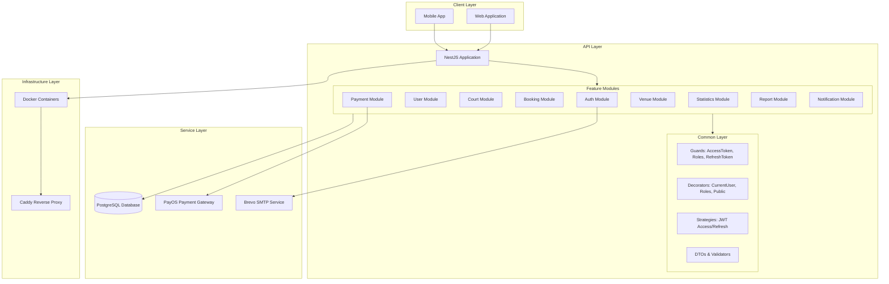
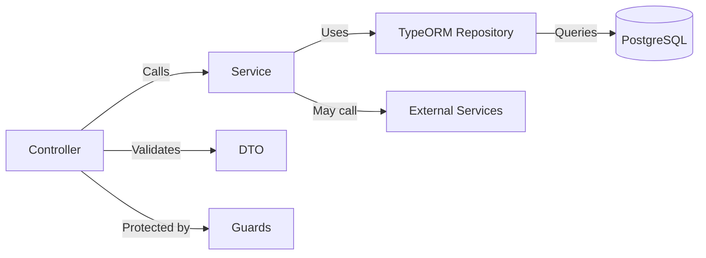
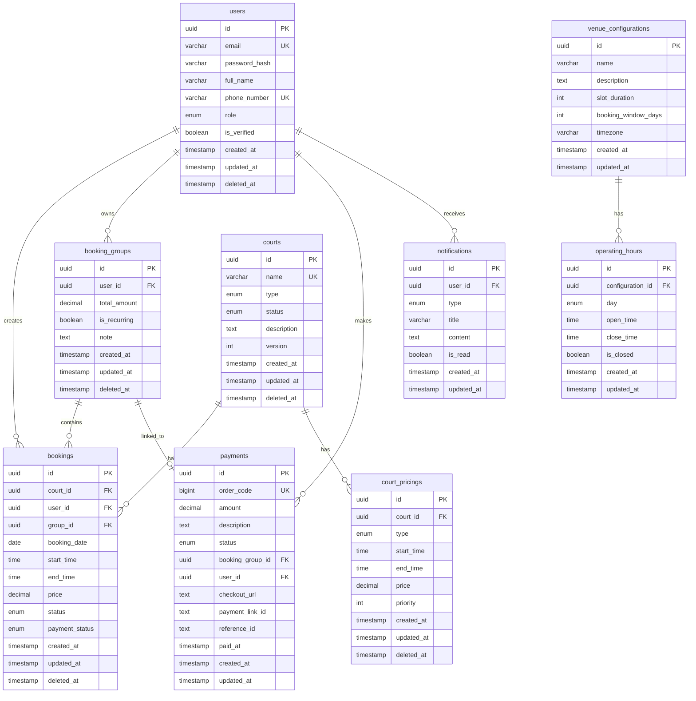
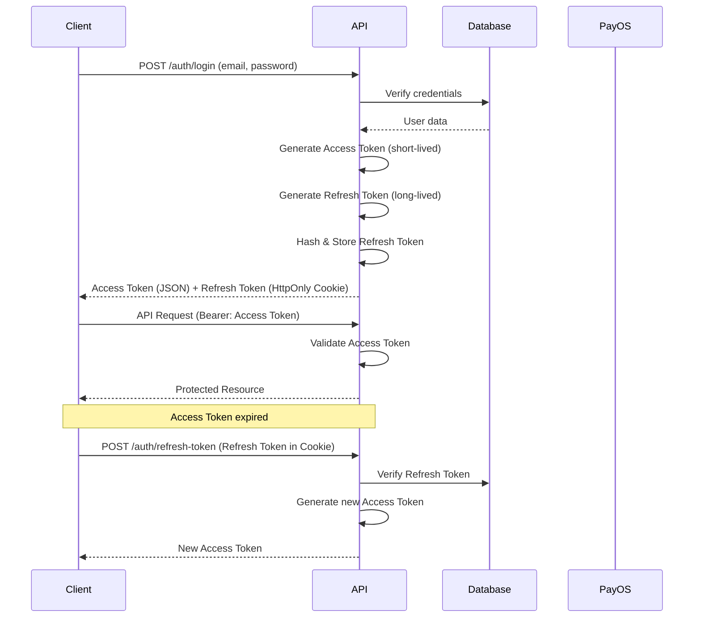
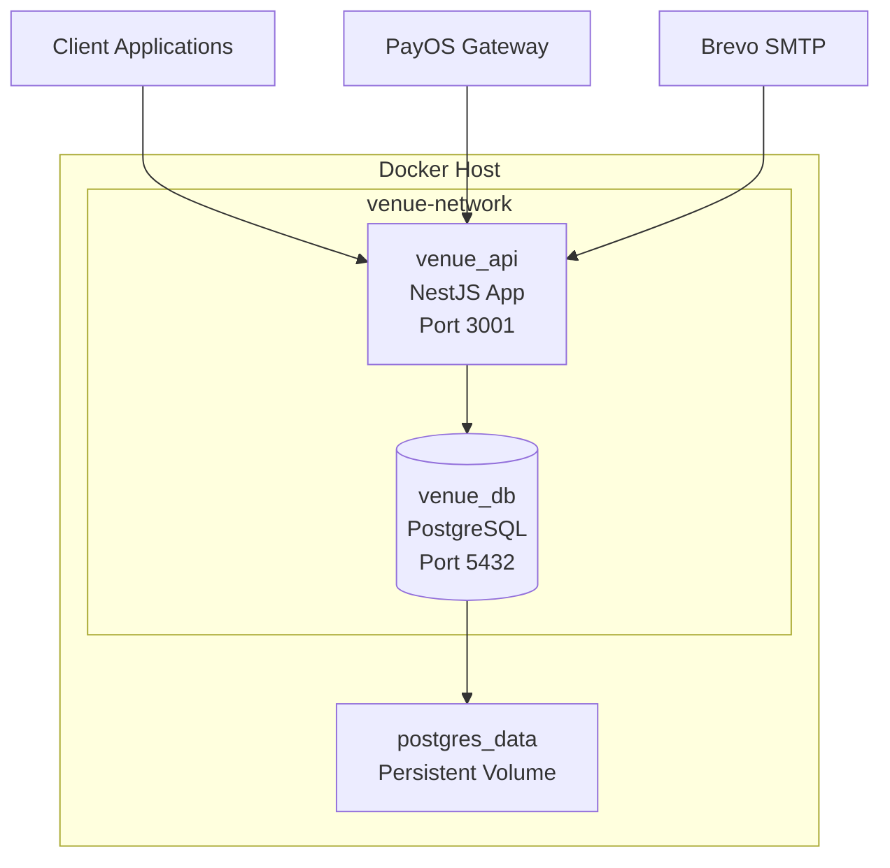

# Software Design Specification (SDS)
## Venue Management System API

**Version:** 1.0  
**Date:** 2025  
**Author:** Development Team

---

## Table of Contents

1. [System Architecture](#1-system-architecture)
2. [Database Design](#2-database-design)
3. [API Design](#3-api-design)
4. [Security Design](#4-security-design)
5. [Technology Stack](#5-technology-stack)
6. [Deployment Architecture](#6-deployment-architecture)

---

## 1. System Architecture

### 1.1 Overview

Hệ thống được xây dựng theo kiến trúc **Modular Monolith** sử dụng framework **NestJS**, áp dụng các nguyên tắc:
- **Separation of Concerns**: Mỗi module độc lập, có trách nhiệm riêng biệt
- **Dependency Injection**: Quản lý dependencies thông qua NestJS DI container
- **Layered Architecture**: Controller → Service → Repository pattern

### 1.2 High-Level Architecture



### 1.3 Module Structure

Hệ thống được tổ chức thành các module độc lập, mỗi module chứa:

```
modules/
├── auth/              # Authentication & Authorization
│   ├── auth.controller.ts
│   ├── auth.service.ts
│   ├── auth.module.ts
│   └── dtos/         # Data Transfer Objects
├── user/              # User Management
├── court/             # Court & Pricing Management
├── booking/           # Booking Management
│   ├── services/
│   │   ├── booking.service.ts
│   │   └── booking-group.service.ts
│   └── entities/
├── payment/            # Payment Processing
├── venue/             # Venue Configuration
├── statistics/        # Statistics & Analytics
├── report/            # Report Generation
└── notification/      # Notification System
```

**Design Pattern áp dụng:**
- **Module Pattern**: Mỗi feature là một NestJS module độc lập
- **Service Pattern**: Business logic được đóng gói trong Service classes
- **Repository Pattern**: TypeORM entities đóng vai trò repository layer
- **DTO Pattern**: Validation và transformation thông qua DTOs

### 1.4 Dependency Flow



**File tham khảo:**
- [app.module.ts](server/src/app.module.ts): Root module configuration
- [main.ts](server/src/main.ts): Application bootstrap

---

## 2. Database Design

### 2.1 Entity Relationship Diagram



### 2.2 Core Tables

#### 2.2.1 Users Table
**Purpose:** Lưu trữ thông tin người dùng và authentication tokens

**Key Fields:**
- `id` (UUID, PK): Primary key
- `email` (VARCHAR, UNIQUE, INDEXED): Email đăng nhập
- `password_hash` (VARCHAR): Mật khẩu đã hash bằng Argon2
- `role` (ENUM: ADMIN, MANAGER, CUSTOMER): Vai trò người dùng
- `is_verified` (BOOLEAN): Trạng thái xác thực email
- `refresh_token_hash` (VARCHAR): Refresh token đã hash
- `verification_token`, `password_reset_token`, `email_change_token`: Các token tạm thời

**Indexes:**
- `email`: Unique index cho login queries
- `phone_number`: Unique index (nullable)
- `role`: Index cho role-based queries
- `is_verified`: Index cho verification status

**File tham khảo:**
- [user.entity.ts](server/src/modules/user/entities/user.entity.ts)

#### 2.2.2 Courts Table
**Purpose:** Quản lý thông tin các sân thể thao

**Key Fields:**
- `id` (UUID, PK)
- `name` (VARCHAR, UNIQUE): Tên sân
- `type` (ENUM: STD, PREMIUM): Loại sân
- `status` (ENUM: ACTIVE, INACTIVE, MAINTENANCE): Trạng thái sân
- `version` (INT): Optimistic locking version

**Relationships:**
- One-to-Many với `court_pricings`: Mỗi sân có nhiều bảng giá
- One-to-Many với `bookings`: Mỗi sân có nhiều booking

**File tham khảo:**
- [court.entity.ts](server/src/modules/court/entities/court.entity.ts)

#### 2.2.3 Court Pricings Table
**Purpose:** Quản lý bảng giá động theo thời gian và loại sân

**Key Fields:**
- `id` (UUID, PK)
- `court_id` (UUID, FK, nullable): Liên kết với sân cụ thể (null = áp dụng cho tất cả)
- `type` (ENUM): Loại sân (STD/PREMIUM)
- `start_time` (TIME): Thời gian bắt đầu
- `end_time` (TIME): Thời gian kết thúc
- `price` (DECIMAL): Giá tiền
- `priority` (INT): Độ ưu tiên (cao hơn = áp dụng trước)

**Design Pattern:**
- **Strategy Pattern**: Pricing rules được áp dụng theo priority
- **Null Object Pattern**: `court_id = null` nghĩa là rule áp dụng cho tất cả sân

**File tham khảo:**
- [court-pricing.entity.ts](server/src/modules/court/entities/court-pricing.entity.ts)

#### 2.2.4 Bookings Table
**Purpose:** Lưu trữ các đặt sân

**Key Fields:**
- `id` (UUID, PK)
- `court_id` (UUID, FK): Sân được đặt
- `user_id` (UUID, FK): Người đặt
- `group_id` (UUID, FK, nullable): Nhóm booking (cho group bookings)
- `booking_date` (DATE): Ngày đặt
- `start_time` (TIME): Giờ bắt đầu
- `end_time` (TIME): Giờ kết thúc
- `price` (DECIMAL): Giá đã tính
- `status` (ENUM: PENDING, CONFIRMED, CANCELLED, COMPLETED, REJECTED)
- `payment_status` (ENUM: PENDING, PAID, FAILED, REFUNDED)

**Indexes:**
- Composite index trên `(date, start_time)`: Tối ưu cho availability queries
- `court_id`: Index cho queries theo sân
- `user_id`: Index cho queries theo user
- `group_id`: Index cho group bookings

**File tham khảo:**
- [booking.entity.ts](server/src/modules/booking/entities/booking.entity.ts)

#### 2.2.5 Booking Groups Table
**Purpose:** Nhóm các booking lại với nhau (cho group bookings và recurring schedules)

**Key Fields:**
- `id` (UUID, PK)
- `user_id` (UUID, FK)
- `total_amount` (DECIMAL): Tổng tiền của nhóm
- `is_recurring` (BOOLEAN): Có phải booking định kỳ không
- `note` (TEXT): Ghi chú

**Relationships:**
- One-to-Many với `bookings`: Một nhóm chứa nhiều booking
- One-to-One với `payments`: Một nhóm có một payment

**File tham khảo:**
- [booking-group.entity.ts](server/src/modules/booking/entities/booking-group.entity.ts)

#### 2.2.6 Payments Table
**Purpose:** Quản lý thanh toán qua PayOS

**Key Fields:**
- `id` (UUID, PK)
- `order_code` (BIGINT, UNIQUE): Mã đơn hàng từ PayOS
- `amount` (DECIMAL): Số tiền
- `status` (ENUM: PENDING, PAID, FAILED, REFUNDED)
- `booking_group_id` (UUID, FK): Liên kết với booking group
- `checkout_url` (TEXT): URL thanh toán từ PayOS
- `payment_link_id` (TEXT): ID payment link
- `paid_at` (TIMESTAMP): Thời gian thanh toán

**File tham khảo:**
- [payment.entity.ts](server/src/modules/payment/entities/payment.entity.ts)

#### 2.2.7 Venue Configurations Table
**Purpose:** Cấu hình chung của venue

**Key Fields:**
- `id` (UUID, PK)
- `name` (VARCHAR): Tên venue
- `slot_duration` (INT): Độ dài mỗi slot (phút, mặc định 30)
- `booking_window_days` (INT): Số ngày có thể đặt trước (mặc định 7)
- `timezone` (VARCHAR): Timezone (mặc định 'Asia/Hanoi')

**Relationships:**
- One-to-Many với `operating_hours`: Mỗi cấu hình có nhiều giờ hoạt động

**File tham khảo:**
- [venue-configuration.entity.ts](server/src/modules/venue/entities/venue-configuration.entity.ts)

#### 2.2.8 Operating Hours Table
**Purpose:** Giờ hoạt động theo từng ngày trong tuần

**Key Fields:**
- `id` (UUID, PK)
- `configuration_id` (UUID, FK)
- `day` (ENUM: MONDAY, TUESDAY, ..., SUNDAY): Ngày trong tuần
- `open_time` (TIME): Giờ mở cửa
- `close_time` (TIME): Giờ đóng cửa
- `is_closed` (BOOLEAN): Có đóng cửa không

**Constraints:**
- Unique constraint trên `(configuration_id, day)`: Mỗi ngày chỉ có một record

**File tham khảo:**
- [operating-hour.entity.ts](server/src/modules/venue/entities/operating-hour.entity.ts)

### 2.3 Base Entity Pattern

Tất cả entities kế thừa từ `BaseEntity` để có các trường chung:

```typescript
// Base fields trong tất cả entities
- id: UUID (Primary Key)
- created_at: Timestamp
- updated_at: Timestamp
- deleted_at: Timestamp (Soft delete)
```

**File tham khảo:**
- [base.entity.ts](server/src/common/entities/base.entity.ts)

### 2.4 Indexing Strategy

**Performance Optimization:**
- **Composite indexes** trên các cặp thường query cùng nhau: `(date, start_time)` trong bookings
- **Foreign key indexes**: Tất cả foreign keys đều có index
- **Unique indexes**: Email, phone_number, order_code
- **Enum indexes**: Role, status fields cho filtering nhanh

**Query Optimization:**
- Availability queries sử dụng composite index `(date, start_time)` để tìm nhanh conflicts
- User bookings queries sử dụng index trên `user_id`
- Court bookings queries sử dụng index trên `court_id`

---

## 3. API Design

### 3.1 API Structure

**Base URL:** `/api/v1`

**Authentication:** Bearer Token (JWT Access Token)  
**Content-Type:** `application/json`

### 3.2 Authentication Endpoints

**Base Path:** `/api/v1/auth`

| Method | Endpoint | Description | Auth Required |
|--------|----------|-------------|---------------|
| POST | `/register` | Đăng ký tài khoản mới | No |
| GET | `/verify-email` | Xác thực email | No |
| POST | `/login` | Đăng nhập | No |
| POST | `/logout` | Đăng xuất | Yes |
| POST | `/refresh-token` | Làm mới access token | Refresh Token |
| POST | `/forgot-password` | Yêu cầu reset password | No |
| POST | `/reset-password` | Reset password với token | No |
| POST | `/change-password` | Đổi mật khẩu | Yes |
| POST | `/change-email` | Yêu cầu đổi email | Yes |
| GET | `/verify-new-email` | Xác thực email mới | No |

**File tham khảo:**
- [auth.controller.ts](server/src/modules/auth/auth.controller.ts)

**Rate Limiting:**
- Registration: 3 requests/60s
- Login, Email verification: 5 requests/60s
- Refresh token: 10 requests/60s
- Password change: 3 requests/60s

### 3.3 User Management Endpoints

**Base Path:** `/api/v1/users`

| Method | Endpoint | Description | Role Required |
|--------|----------|-------------|----------------|
| GET | `/profile` | Lấy thông tin profile | CUSTOMER |
| PATCH | `/profile` | Cập nhật profile | CUSTOMER |
| GET | `/` | Danh sách users (pagination) | ADMIN, MANAGER |
| DELETE | `/:id` | Xóa user (soft delete) | ADMIN |
| PATCH | `/:id/restore` | Khôi phục user | ADMIN |

**File tham khảo:**
- [user.controller.ts](server/src/modules/user/user.controller.ts)

### 3.4 Court Management Endpoints

**Base Path:** `/api/v1/courts`

| Method | Endpoint | Description | Auth Required | Role Required |
|--------|----------|-------------|----------------|---------------|
| GET | `/` | Danh sách courts | No | - |
| GET | `/:id/available` | Lấy available slots | No | - |
| POST | `/` | Tạo court mới | Yes | ADMIN, MANAGER |
| PATCH | `/:id` | Cập nhật court | Yes | ADMIN, MANAGER |
| DELETE | `/:id` | Xóa court | Yes | ADMIN, MANAGER |
| PATCH | `/:id/restore` | Khôi phục court | Yes | ADMIN, MANAGER |
| POST | `/pricing` | Tạo pricing rule | Yes | ADMIN, MANAGER |
| PATCH | `/pricing/:id` | Cập nhật pricing | Yes | ADMIN, MANAGER |
| DELETE | `/pricing/:id` | Xóa pricing | Yes | ADMIN, MANAGER |
| PATCH | `/pricing/:id/restore` | Khôi phục pricing | Yes | ADMIN, MANAGER |

**File tham khảo:**
- [court.controller.ts](server/src/modules/court/court.controller.ts)

### 3.5 Booking Management Endpoints

**Base Path:** `/api/v1/bookings`

| Method | Endpoint | Description | Auth Required | Role Required |
|--------|----------|-------------|----------------|---------------|
| POST | `/` | Tạo booking mới | Yes | CUSTOMER |
| GET | `/user` | Danh sách bookings của user | Yes | CUSTOMER |
| GET | `/manager` | Danh sách bookings (pagination) | Yes | ADMIN, MANAGER |
| PATCH | `/:id/cancel` | Hủy booking | Yes | CUSTOMER (own) or ADMIN/MANAGER |

**File tham khảo:**
- [booking.controller.ts](server/src/modules/booking/booking.controller.ts)

### 3.6 Payment Endpoints

**Base Path:** `/api/v1/payments`

| Method | Endpoint | Description | Auth Required | Public |
|--------|----------|-------------|----------------|--------|
| POST | `/create-link` | Tạo payment link từ PayOS | Yes | No |
| POST | `/webhook` | Webhook từ PayOS | No | Yes |

**File tham khảo:**
- [payment.controller.ts](server/src/modules/payment/payment.controller.ts)

### 3.7 Statistics Endpoints

**Base Path:** `/api/v1/statistics`

| Method | Endpoint | Description | Role Required |
|--------|----------|-------------|----------------|
| GET | `/` | Thống kê (revenue, occupancy) | ADMIN, MANAGER |

**Query Parameters:**
- `startDate`: Ngày bắt đầu
- `endDate`: Ngày kết thúc
- `courtId` (optional): Lọc theo sân

**File tham khảo:**
- [statistics.controller.ts](server/src/modules/statistics/statistics.controller.ts)

### 3.8 Report Endpoints

**Base Path:** `/api/v1/report`

| Method | Endpoint | Description | Role Required |
|--------|----------|-------------|----------------|
| GET | `/daily` | Export báo cáo ngày (Excel) | ADMIN, MANAGER |

**File tham khảo:**
- [report.controller.ts](server/src/modules/report/report.controller.ts)

### 3.9 Venue Configuration Endpoints

**Base Path:** `/api/v1/venue`

| Method | Endpoint | Description | Role Required |
|--------|----------|-------------|----------------|
| GET | `/config` | Lấy cấu hình venue | - |
| PATCH | `/config` | Cập nhật cấu hình | ADMIN, MANAGER |
| GET | `/operating-hours` | Lấy giờ hoạt động | - |
| PATCH | `/operating-hours` | Cập nhật giờ hoạt động | ADMIN, MANAGER |

### 3.10 Notification Endpoints

**Base Path:** `/api/v1/notifications`

| Method | Endpoint | Description | Auth Required |
|--------|----------|-------------|----------------|
| GET | `/` | Danh sách notifications | Yes |
| PATCH | `/:id/read` | Đánh dấu đã đọc | Yes |

### 3.11 Response Format

**Success Response:**
```json
{
  "data": { ... },
  "message": "Success message (optional)"
}
```

**Error Response:**
```json
{
  "statusCode": 400,
  "message": "Error message",
  "error": "Bad Request"
}
```

**Pagination Response:**
```json
{
  "data": [ ... ],
  "meta": {
    "page": 1,
    "limit": 10,
    "total": 100,
    "totalPages": 10
  }
}
```

### 3.12 API Documentation

Swagger/OpenAPI documentation available at:
```
http://localhost:3001/api/v1/docs
```

**File tham khảo:**
- [main.ts](server/src/main.ts): Swagger configuration

---

## 4. Security Design

### 4.1 Authentication Architecture

**JWT-based Authentication với Dual Token Strategy:**



**Token Strategy:**
- **Access Token**: Short-lived (default: 15 minutes), stored in memory/client
- **Refresh Token**: Long-lived (default: 7 days), stored in HttpOnly cookie
- **Token Rotation**: Refresh token được rotate mỗi lần refresh

**File tham khảo:**
- [access-token.strategy.ts](server/src/common/strategies/access-token.strategy.ts)
- [refresh-token.strategy.ts](server/src/common/strategies/refresh-token.strategy.ts)
- [access-token.guard.ts](server/src/common/guards/access-token.guard.ts)

### 4.2 Authorization (RBAC)

**Role-Based Access Control với 3 roles:**

| Role | Permissions |
|------|------------|
| **ADMIN** | Full system access, user management, venue configuration |
| **MANAGER** | Court management, booking management, statistics, reports |
| **CUSTOMER** | View courts, create bookings, manage own profile |

**Implementation:**
- `@Roles()` decorator để đánh dấu endpoints cần role cụ thể
- `RolesGuard` kiểm tra role của user từ JWT payload
- `@CurrentUser()` decorator để inject user info vào controller

**File tham khảo:**
- [roles.guard.ts](server/src/common/guards/roles.guard.ts)
- [roles.decorator.ts](server/src/common/decorators/roles.decorator.ts)
- [role.enum.ts](server/src/common/enums/role.enum.ts)

### 4.3 Password Security

**Argon2 Hashing:**
- Algorithm: Argon2id (resistant to both GPU and side-channel attacks)
- Salt: Auto-generated per password
- Cost parameters: Tuned for security vs performance balance

**Password Policies:**
- Minimum length: Enforced via DTO validation
- Password reset: Token-based với expiry
- Password change: Requires current password verification

**File tham khảo:**
- [auth.service.ts](server/src/modules/auth/auth.service.ts): Password hashing implementation

### 4.4 Rate Limiting

**Two-tier Rate Limiting:**

1. **Short-term (Throttle):**
   - TTL: 60 seconds
   - Limit: Configurable per endpoint
   - Purpose: Prevent brute force attacks

2. **Long-term (Throttle):**
   - TTL: 15 minutes
   - Limit: Higher than short-term
   - Purpose: Prevent abuse over time

**Implementation:**
- NestJS Throttler module
- Applied globally via `APP_GUARD`
- Can be skipped with `@SkipThrottle()` decorator
- Can be customized with `@Throttle()` decorator

**File tham khảo:**
- [app.module.ts](server/src/app.module.ts): Throttler configuration
- [rate-limit.config.ts](server/src/config/rate-limit.config.ts)

### 4.5 Input Validation

**Class-Validator Pattern:**
- All DTOs use `class-validator` decorators
- Global `ValidationPipe` với:
  - `whitelist: true`: Strip unknown properties
  - `forbidNonWhitelisted: true`: Reject unknown properties
  - `transform: true`: Auto-transform types

**File tham khảo:**
- [main.ts](server/src/main.ts): ValidationPipe configuration
- Example DTOs in `modules/*/dtos/`

### 4.6 Security Headers

**Helmet.js Integration:**
- XSS Protection
- Content Security Policy
- Frame Options
- HSTS (in production)

**File tham khảo:**
- [main.ts](server/src/main.ts): Helmet middleware

### 4.7 CORS Configuration

**Restrictive CORS:**
- Only allows requests from configured `CLIENT_URL`
- Credentials enabled for cookie-based auth
- Specific HTTP methods allowed

**File tham khảo:**
- [main.ts](server/src/main.ts): CORS configuration

### 4.8 SQL Injection Prevention

**TypeORM Parameterized Queries:**
- All queries use parameterized statements
- No raw SQL string concatenation
- Entity-based queries prevent injection

### 4.9 Webhook Security

**PayOS Webhook Verification:**
- Checksum verification using `PAYOS_CHECKSUM_KEY`
- Validates webhook signature before processing
- Idempotency handling for duplicate webhooks

**File tham khảo:**
- [payment.service.ts](server/src/modules/payment/payment.service.ts)

---

## 5. Technology Stack

### 5.1 Core Framework & Language

| Technology | Version | Purpose |
|------------|---------|---------|
| **NestJS** | ^11.0.1 | Main framework (Node.js) |
| **TypeScript** | ^5.7.3 | Programming language |
| **Node.js** | v20+ | Runtime environment |

**Why NestJS?**
- Modular architecture out-of-the-box
- Built-in Dependency Injection
- TypeScript-first approach
- Enterprise-grade patterns
- Excellent documentation

### 5.2 Database & ORM

| Technology | Version | Purpose |
|------------|---------|---------|
| **PostgreSQL** | 15+ | Relational database |
| **TypeORM** | ^0.3.28 | Object-Relational Mapping |
| **pg** | ^8.16.3 | PostgreSQL driver |

**Why PostgreSQL?**
- ACID compliance
- Advanced indexing (B-tree, GIN, GiST)
- JSON support
- Full-text search capabilities
- Excellent performance for complex queries

**Why TypeORM?**
- TypeScript-native
- Active Record & Data Mapper patterns
- Migration support
- Entity relationships management

### 5.3 Authentication & Security

| Technology | Version | Purpose |
|------------|---------|---------|
| **@nestjs/jwt** | ^11.0.2 | JWT token generation/validation |
| **@nestjs/passport** | ^11.0.5 | Authentication middleware |
| **passport-jwt** | ^4.0.1 | JWT strategy for Passport |
| **argon2** | ^0.44.0 | Password hashing |
| **@nestjs/throttler** | ^6.5.0 | Rate limiting |
| **helmet** | ^8.1.0 | Security headers |

### 5.4 Validation & Transformation

| Technology | Version | Purpose |
|------------|---------|---------|
| **class-validator** | ^0.14.3 | DTO validation |
| **class-transformer** | ^0.5.1 | Object transformation |

### 5.5 External Services

| Service | Purpose | Integration |
|---------|---------|-------------|
| **PayOS** | Payment gateway | `@payos/node` package |
| **Brevo (Sendinblue)** | SMTP email service | `@getbrevo/brevo` package |

### 5.6 Logging

| Technology | Version | Purpose |
|------------|---------|---------|
| **winston** | ^3.19.0 | Logging library |
| **nest-winston** | ^1.10.2 | NestJS Winston integration |
| **winston-daily-rotate-file** | ^5.0.0 | Daily log rotation |

**Logging Strategy:**
- Console logging in development
- File-based logging in production
- Daily rotation to prevent disk overflow
- Structured logging with metadata

**File tham khảo:**
- [logger.service.ts](server/src/providers/logger/logger.service.ts)

### 5.7 Documentation

| Technology | Version | Purpose |
|------------|---------|---------|
| **@nestjs/swagger** | ^11.2.4 | OpenAPI/Swagger documentation |

### 5.8 Utilities

| Technology | Version | Purpose |
|------------|---------|---------|
| **dayjs** | ^1.11.19 | Date manipulation |
| **uuid** | ^13.0.0 | UUID generation |
| **exceljs** | ^4.4.0 | Excel report generation |
| **cookie-parser** | ^1.4.7 | Cookie parsing |
| **joi** | ^18.0.2 | Environment validation |

### 5.9 Development Tools

| Technology | Purpose |
|------------|---------|
| **ESLint** | Code linting |
| **Prettier** | Code formatting |
| **Jest** | Testing framework |
| **TypeORM CLI** | Migration management |

**File tham khảo:**
- [package.json](server/package.json): Full dependency list

---

## 6. Deployment Architecture

### 6.1 Container Architecture

**Docker Compose Setup:**



**File tham khảo:**
- [docker-compose.yml](docker-compose.yml)

### 6.2 Service Configuration

#### 6.2.1 API Service (NestJS)

**Container:** `venue_api`

**Configuration:**
- Build context: `./server`
- Dockerfile: [server/Dockerfile](server/Dockerfile)
- Port mapping: `${PORT:-3001}:${PORT:-3001}`
- Environment variables: Loaded from `./server/.env`
- Network: `venue-network`
- Restart policy: `always`

**Dependencies:**
- Depends on `postgres` service
- Waits for database to be ready

#### 6.2.2 Database Service (PostgreSQL)

**Container:** `venue_db`

**Configuration:**
- Image: `postgres:15-alpine`
- Port mapping: `${DB_PORT:-5432}:5432`
- Persistent volume: `postgres_data`
- Network: `venue-network`
- Restart policy: `always`

**Data Persistence:**
- Volume mounted to `/var/lib/postgresql/data`
- Survives container restarts
- Can be backed up independently

### 6.3 Environment Configuration

**Environment Variables Structure:**

```bash
# Application
APP_ENV=development|production
PORT=3001
CLIENT_URL=http://localhost:3000

# Database
DB_HOST=postgres  # Use 'postgres' for Docker, 'localhost' for local
DB_PORT=5432
DB_USER=venue_user
DB_PASSWORD=secure_password
DB_NAME=venue_db

# JWT
JWT_ACCESS_SECRET=your_access_secret
JWT_ACCESS_EXPIRY=15m
JWT_REFRESH_SECRET=your_refresh_secret
JWT_REFRESH_EXPIRY=7d

# Rate Limiting
RATE_LIMIT_TTL=60000
RATE_LIMIT_LIMIT=100

# SMTP (Brevo)
SMTP_HOST=smtp-relay.brevo.com
SMTP_PORT=587
SMTP_USER=your_brevo_user
SMTP_PASS=your_brevo_api_key
SMTP_FROM=noreply@venue.com

# Payment (PayOS)
PAYOS_CLIENT_ID=your_client_id
PAYOS_API_KEY=your_api_key
PAYOS_CHECKSUM_KEY=your_checksum_key
```

**File tham khảo:**
- [docker-compose.yml](docker-compose.yml): Environment variable mapping
- [config/environments/validation.ts](server/src/config/environments/validation.ts): Environment validation

### 6.4 Database Migrations

**Migration Management:**

```bash
# Generate migration
npm run migration:generate -- src/database/migrations/MigrationName

# Run migrations
npm run migration:run

# Revert migration
npm run migration:revert
```

**Migration Files:**
- [1768327573284-init_core_domain_schema.ts](server/src/database/migrations/1768327573284-init_core_domain_schema.ts)
- [1768378907157-update_court_and_court_pricing_tables.ts](server/src/database/migrations/1768378907157-update_court_and_court_pricing_tables.ts)

**File tham khảo:**
- [data-source.ts](server/src/database/data-source.ts): TypeORM data source configuration

### 6.5 Database Seeding

**Initial Seed:**
```bash
npm run seed:run
```
- Creates default admin user
- Creates manager users
- Sets up venue configuration
- Creates sample courts and operating hours

**Big Data Seed (Performance Testing):**
```bash
npm run seed:big
```
- Generates 1,000,000 booking records
- Used for performance testing

**File tham khảo:**
- [initial.seed.ts](server/src/database/seeds/initial.seed.ts)
- [big-data.seed.ts](server/src/database/seeds/big-data.seed.ts)

### 6.6 Production Deployment

**Recommended Production Setup:**

1. **Reverse Proxy (Caddy):**
   - Automatic HTTPS with Let's Encrypt
   - Load balancing (if multiple API instances)
   - SSL termination

2. **Database:**
   - Separate database server (not in Docker for production)
   - Regular backups
   - Connection pooling

3. **Monitoring:**
   - Application logs aggregation
   - Health check endpoints
   - Database performance monitoring

4. **Scaling:**
   - Horizontal scaling: Multiple API containers
   - Database read replicas for statistics queries
   - Redis for caching (future enhancement)

### 6.7 Health Checks

**Recommended Health Check Endpoint:**
```typescript
GET /health
Response: { status: 'ok', database: 'connected', timestamp: '...' }
```

### 6.8 Backup Strategy

**Database Backups:**
- Daily automated backups
- Retention: 30 days
- Backup location: Separate volume or cloud storage

**Application Backups:**
- Environment configuration
- Migration files
- Seed data scripts

---

## Appendix

### A. File Structure Reference

```
server/
├── src/
│   ├── common/              # Shared utilities
│   │   ├── decorators/      # Custom decorators
│   │   ├── guards/          # Auth & role guards
│   │   ├── strategies/      # Passport strategies
│   │   ├── entities/        # Base entity
│   │   └── enums/           # Shared enums
│   ├── config/              # Configuration modules
│   ├── database/            # Migrations & seeds
│   ├── modules/             # Feature modules
│   ├── providers/           # External service providers
│   └── main.ts              # Application entry point
├── test/                    # E2E tests
└── package.json
```

### B. Key Design Decisions

1. **Modular Monolith**: Chosen over microservices for simplicity and easier development
2. **TypeORM**: Selected for TypeScript-native ORM with migration support
3. **JWT Dual Token**: Access + Refresh tokens for security and UX balance
4. **Soft Delete**: All entities support soft delete for data recovery
5. **Optimistic Locking**: Court entity uses version column for concurrent updates
6. **Dynamic Pricing**: Priority-based pricing rules for flexibility

### C. Performance Considerations

1. **Database Indexes**: Strategic indexing on frequently queried fields
2. **Query Optimization**: Composite indexes for availability queries
3. **Connection Pooling**: TypeORM connection pool configuration
4. **Rate Limiting**: Prevents abuse and ensures fair resource usage
5. **Caching Opportunities**: Future enhancement for court availability queries

---

**Document Version:** 1.0  
**Last Updated:** 2025  
